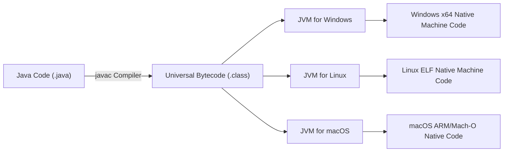
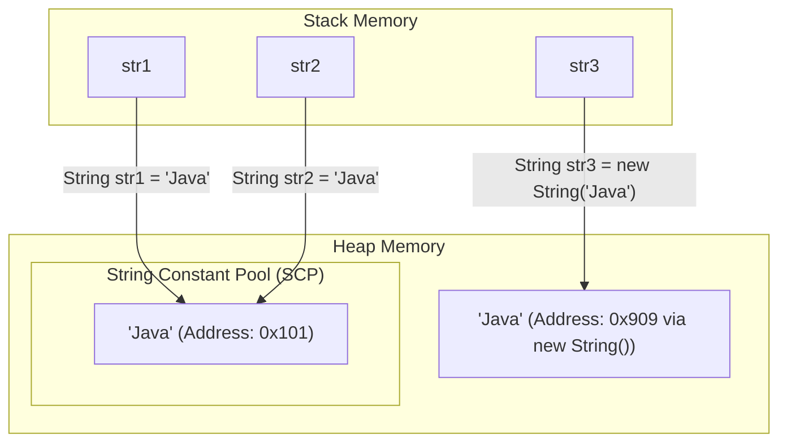
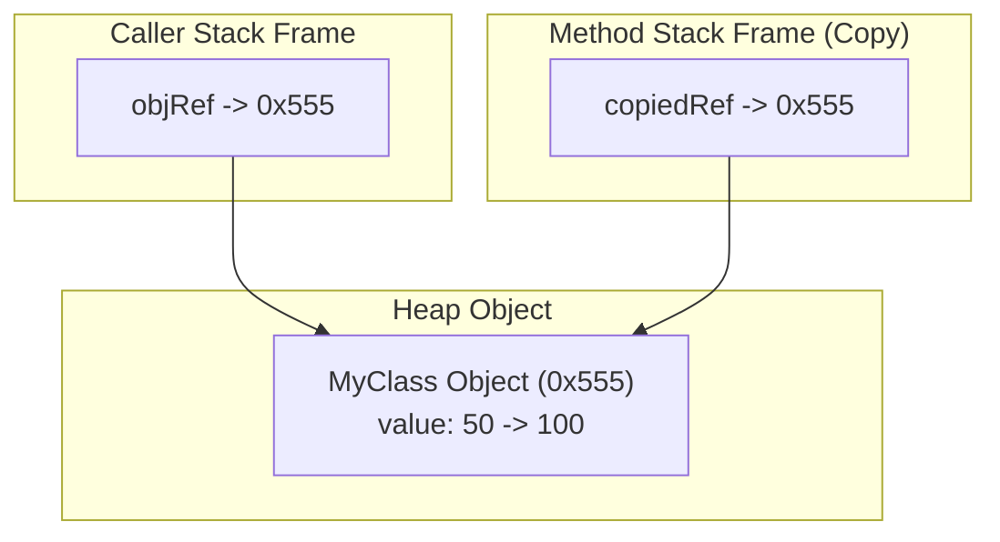
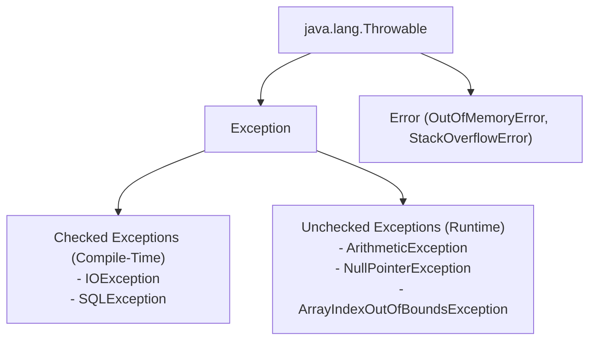

# ❓ Top Core Java Interview Questions & Detailed Answers

This document provides a comprehensive, expert-curated collection of the most frequently asked **Core Java Interview Questions** ranging from fundamental concepts to memory management and internals.

---

## 📋 Table of Contents
1. [Architecture & Platform Independence](#1-architecture--platform-independence)
2. [Data Types, Variables & Memory Management](#2-data-types-variables--memory-management)
3. [Strings & Memory Optimization](#3-strings--memory-optimization)
4. [Methods, Parameters & Pass-by-Value](#4-methods-parameters--pass-by-value)
5. [Control Flow & Exceptions](#5-control-flow--exceptions)
6. [Keywords: static, final, super, this](#6-keywords-static-final-super-this)

---

## 1. Architecture & Platform Independence

### Q1: Why is Java called a "Platform-Independent" language, while JVM is platform-dependent?
**Answer**: 
- **Java Platform Independence**: When Java code is compiled using `javac`, it is not converted into machine-specific native code. Instead, it is compiled into an intermediate byte-level representation called **Bytecode (`.class` file)**. Bytecode is universal and independent of OS hardware.
- **JVM Platform Dependence**: The **JVM (Java Virtual Machine)** reads bytecode and translates it into native CPU machine instructions. Because Windows, macOS, Linux, and ARM/x86 architectures have different instruction sets, each operating system requires a custom JVM built specifically for that platform. Thus, JVM is platform-dependent.



---

### Q2: Explain the exact breakdown of `public static void main(String[] args)` signature.
**Answer**:
- `public`: Access modifier allowing the JVM to invoke `main()` from anywhere outside the package.
- `static`: Enables the JVM to call `main()` without creating an instance/object of the class first (`ClassName.main()`), saving heap memory before program startup.
- `void`: Return type indicating `main()` does not return any value back to the caller (JVM).
- `main`: Name of the default entry point method recognized by JVM specs.
- `String[] args`: Command-line arguments passed to the program as an array of `String` objects.

---

## 2. Data Types, Variables & Memory Management

### Q3: What is the difference between Primitive Data Types and Wrapper Classes?
**Answer**:

| Feature | Primitive Types (`int`, `double`, `boolean`) | Wrapper Classes (`Integer`, `Double`, `Boolean`) |
| :--- | :--- | :--- |
| **Definition** | Predefined basic data types stored directly on stack memory | Objects holding primitive values inside `java.lang` package |
| **Memory Allocation** | Allocated on Stack (fast, contiguous memory) | Allocated on Heap as Objects (overhead of object header) |
| **Nullability** | Cannot be `null` (has default value e.g., `0`, `false`) | Can be `null` |
| **Collections Support** | Cannot be used in Java Collections (`List<int>` ❌) | Required in Java Collections (`List<Integer>` ✅) |
| **Methods Support** | No methods available | Contains utility methods (`Integer.parseInt()`, `Double.valueOf()`) |

---

### Q4: Explain Autoboxing and Unboxing with code examples.
**Answer**:
- **Autoboxing**: Automatic conversion of primitive data types into their corresponding Wrapper Objects by the Java compiler.
- **Unboxing**: Automatic conversion of Wrapper Objects back into their primitive values.

```java
// Autoboxing example
int primInt = 50;
Integer wrappedInt = primInt; // Compiler transforms to: Integer.valueOf(primInt)

// Unboxing example
Integer objVal = 100;
int rawInt = objVal; // Compiler transforms to: objVal.intValue()
```

---

## 3. Strings & Memory Optimization

### Q5: Why are Strings immutable in Java? What are the benefits?
**Answer**:
Once a `String` object is created in Java, its character content cannot be modified. Any alteration creates a new `String` object in memory.

**Key Reasons & Benefits**:
1. **String Constant Pool (SCP) Optimization**: Shared memory storage. Multiple string literals with identical content point to the same memory reference.
2. **Security**: Strings are heavily used in database URLs, usernames, passwords, socket addresses, and class loading (`Class.forName()`). Immutability prevents malicious tampering.
3. **Thread Safety**: Immutable objects are inherently thread-safe and can be shared freely across multiple threads without synchronization locks.
4. **Caching HashCode**: The `hashCode()` of a String is calculated once and cached (`hash` field). This makes String lookups in `HashMap` extremely fast.



---

### Q6: What is the difference between `==` operator and `.equals()` method?
**Answer**:
- `==` Operator: Compares **memory reference addresses** (checks if both variables point to the exact same object in memory).
- `.equals()` Method: Compares the **actual content/state** inside objects (overridden in `String`, `Integer`, etc. to compare values).

```java
String s1 = "Hello";
String s2 = "Hello";
String s3 = new String("Hello");

System.out.println(s1 == s2);      // true  (Both point to same SCP reference)
System.out.println(s1 == s3);      // false (s3 is a separate Heap object)
System.out.println(s1.equals(s3)); // true  (Content 'Hello' is identical)
```

---

## 4. Methods, Parameters & Pass-by-Value

### Q7: Is Java Pass-by-Value or Pass-by-Reference? Prove your answer.
**Answer**:
Java is **STRICTLY PASS-BY-VALUE**.

- **For Primitives**: A copy of the actual primitive value is passed into the method stack frame. Changes to the parameter inside the method do not affect the caller's variable.
- **For Objects**: A copy of the **object reference address** is passed. 
  - Modifying object attributes via the copied reference *mutates the shared object*.
  - Reassigning the parameter reference to a `new` object does *NOT* change the caller's original reference address.



---

## 5. Control Flow & Exceptions

### Q8: What is the difference between Checked and Unchecked Exceptions?
**Answer**:



| Feature | Checked Exception | Unchecked Exception (RuntimeException) |
| :--- | :--- | :--- |
| **Detection Time** | Checked at **Compile-Time** by `javac` | Occurs at **Runtime** |
| **Handling Requirement** | Mandatory (`try-catch` or `throws` declaration) | Optional (Compiler does not force handling) |
| **Inheritance** | Extends `java.lang.Exception` directly | Extends `java.lang.RuntimeException` |
| **Examples** | `IOException`, `FileNotFoundException`, `SQLException` | `NullPointerException`, `ArithmeticException`, `IndexOutOfBoundsException` |

---

## 6. Keywords: static, final, super, this

### Q9: Differentiate between `final`, `finally`, and `finalize()`.
**Answer**:
1. `final` (Keyword): Used to apply restrictions.
   - `final variable`: Constant value (cannot be reassigned).
   - `final method`: Cannot be overridden in subclasses.
   - `final class`: Cannot be inherited (`extends`).
2. `finally` (Block): Used with `try-catch` for cleanup actions (closing files/connections). Executed regardless of whether an exception is thrown or caught.
3. `finalize()` (Method): Protected method of `java.lang.Object` invoked by Garbage Collector before an object is reclaimed (deprecated since Java 9).

---

### Q10: What is the difference between `static` and `instance` members?
**Answer**:
- `static` Members: Belong to the **Class itself**. Allocated memory once when the class is loaded into the JVM Method Area. Shared across all instances of the class.
- `instance` Members: Belong to **individual objects**. Allocated separate memory on the Heap whenever an object is instantiated using `new`.
