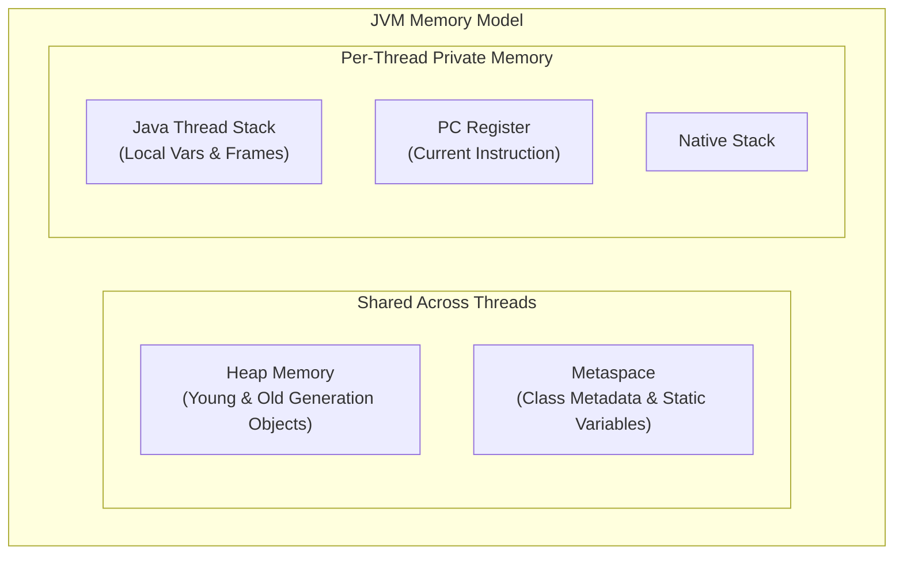
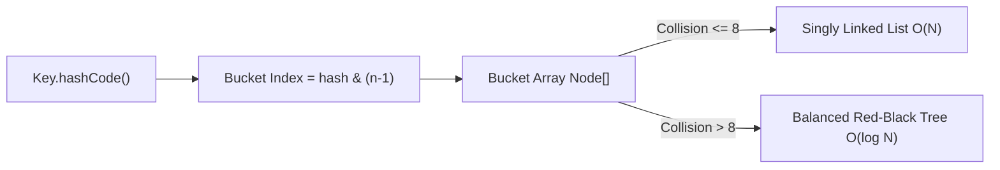

# ❓ Core Java Interview Q&A Guide (Campus Placements & Technical Interviews)

This document is a comprehensive, production-grade collection of **Core Java Technical Interview Questions & Answers**, tailored for college students, software engineers, and job seekers preparing for campus recruitment, service, and product-based company interviews (FAANG, Tier-1 Tech).

---

## 📋 Table of Contents
1. [Java Architecture & Memory Model](#1-java-architecture--memory-model)
2. [Object-Oriented Programming (OOPs)](#2-object-oriented-programming-oops)
3. [String Pool & Immutability](#3-string-pool--immutability)
4. [Exception Handling & Memory Leaks](#4-exception-handling--memory-leaks)
5. [Java Collections Framework & Internals](#5-java-collections-framework--internals)
6. [Multithreading, Concurrency & Synchronization](#6-multithreading-concurrency--synchronization)
7. [Modern Java (Java 8 - 21+)](#7-modern-java-java-8---21)

---

## 1. Java Architecture & Memory Model

### Q1: Why is Java platform-independent, but JVM is platform-dependent?
**Answer**: 
- **Java Compiler (`javac`)**: Converts source code `.java` into universal, OS-agnostic **Bytecode (`.class`)**.
- **JVM**: Translates bytecode into host CPU machine instructions. Because Windows, Linux, and macOS have different operating systems and CPU architectures, each OS has its own platform-specific JVM implementation.

### Q2: Explain the JVM Memory Structure (Heap, Stack, Metaspace, PC Register, Native Stack).
**Answer**:
1. **Heap Area**: Stores all objects created via `new` keyword and instance variables. Shared across all threads, managed by Garbage Collector.
2. **Stack Area**: Stores method call frames, local variables, primitives, and reference pointers to objects on Heap. Private to each thread.
3. **Metaspace (Replaced PermGen in Java 8)**: Stores class metadata, bytecode instructions, static methods, and static variables. Allocated in native memory.
4. **PC (Program Counter) Register**: Keeps track of the current executing bytecode instruction address for each active thread.
5. **Native Method Stack**: Executes native C/C++ code via JNI (Java Native Interface).

### Q3: How does Garbage Collection (GC) work in Java?
**Answer**:
Garbage Collection automatically reclaims heap memory occupied by unreachable objects (objects no longer referenced by any active thread stack).
- **Mark Phase**: Identifies all live referenced objects starting from GC Roots.
- **Sweep Phase**: Reclaims memory of unreferenced unreachable objects.
- **Generational GC Model**:
  - **Young Generation (Eden, Survivor S0, S1)**: Short-lived objects. Fast Minor GC.
  - **Old / Tenured Generation**: Objects surviving multiple GC cycles. Major / Full GC.

---

## 2. Object-Oriented Programming (OOPs)

### Q4: Explain the 4 Pillars of OOPs with real-world examples.
**Answer**:
1. **Encapsulation**: Bundling fields and methods inside a class, hiding private fields (`private balance`), providing getters/setters (Bank Account).
2. **Inheritance**: Subclass inheriting fields & methods from Superclass (`Dog extends Animal`) using `extends`.
3. **Polymorphism**: Ability to take multiple forms:
   - *Compile-time*: Method Overloading (same name, different params).
   - *Runtime*: Method Overriding (`@Override` method in subclass).
4. **Abstraction**: Hiding internal implementation details and showing only necessary interface buttons (TV Remote, Driving a Car).

### Q5: What is the difference between Abstract Class and Interface in Java 8+?
**Answer**:

| Feature | Abstract Class | Interface (Java 8+) |
| :--- | :--- | :--- |
| **Multiple Inheritance** | Classes cannot extend multiple abstract classes | A class can implement multiple interfaces |
| **Instance Variables** | Can have non-final, non-static instance fields | Fields are implicitly `public static final` constants |
| **Methods** | Can have abstract & concrete methods | Abstract methods, `default` methods, and `static` methods |
| **Constructors** | Can have constructors | Cannot have constructors |
| **Keyword** | `extends` | `implements` |

### Q6: What is the Diamond Problem and how is it resolved in Java?
**Answer**:
When Class C inherits from Class A and Class B, and both A and B have a method `foo()`, compiler cannot determine which `foo()` to execute.
- Java disallows multiple class inheritance (`class C extends A, B` ❌).
- In Java 8+ interfaces with `default` methods, if a class implements two interfaces with colliding default methods, the compiler requires the class to explicitly `@Override` the method and resolve the collision: `InterfaceA.super.foo();`.

---

## 3. String Pool & Immutability

### Q7: Why are Strings Immutable in Java?
**Answer**:
1. **String Constant Pool (SCP) Optimization**: Multiple literal references share the same memory location.
2. **Security**: Strings store database credentials, URLs, and network sockets; immutability prevents unauthorized mutation.
3. **Thread Safety**: Immutable strings can be shared across multiple concurrent threads without locks.
4. **HashCode Caching**: `hashCode` is calculated once and cached for fast `HashMap` lookups.

### Q8: Compare `String`, `StringBuilder`, and `StringBuffer`.
**Answer**:

| Feature | `String` | `StringBuilder` | `StringBuffer` |
| :--- | :--- | :--- | :--- |
| **Mutability** | Immutable | Mutable | Mutable |
| **Thread Safety** | Thread-safe (Immutable) | **Not Thread-safe** (Fastest) | **Thread-safe** (Synchronized) |
| **Performance** | Slow for concatenations | **Fastest** for loops | Slower due to synchronization overhead |
| **Storage** | String Pool / Heap | Heap Buffer | Heap Buffer |

---

## 4. Exception Handling & Memory Leaks

### Q9: Difference between Checked Exception, Unchecked Exception, and Error.
**Answer**:
- **Checked Exception**: Subclass of `Exception` (excluding RuntimeException). Checked at compile-time by `javac`. Must be handled (`try-catch` or `throws`). Example: `IOException`, `SQLException`.
- **Unchecked Exception**: Subclass of `RuntimeException`. Occurs at runtime. Compiler does not force handling. Example: `NullPointerException`, `ArithmeticException`.
- **Error**: Irrecoverable system conditions. Should not be caught. Example: `OutOfMemoryError`, `StackOverflowError`.

### Q10: What causes a Memory Leak in Java if it has Garbage Collection?
**Answer**:
A memory leak occurs when unneeded objects remain referenced by active GC Roots, preventing the Garbage Collector from reclaiming their memory.
**Common Causes**:
1. Static references holding onto large objects.
2. Unclosed resource streams (`InputStream`, `Connection`, `Scanner`).
3. Overriding `equals()` without overriding `hashCode()` in custom HashMap keys.
4. Unregistered event listeners or thread-local variables.

---

## 5. Java Collections Framework & Internals

### Q11: How does `HashMap` work internally in Java 8?
**Answer**:
`HashMap` stores data in an array of Buckets (`Node<K,V>[] table`).
1. **Index Calculation**: `hash = key.hashCode()`, `index = hash & (n - 1)`.
2. **Collision Handling**: If two keys hash to the same bucket index:
   - Stored as a **Singly Linked List**.
   - **Java 8 Optimization (Treeification)**: If bucket collision count exceeds 8 (`TREEIFY_THRESHOLD = 8`) and total capacity $\ge 64$, the LinkedList is converted into a **Red-Black Tree**, reducing lookup time from $O(N)$ to $O(\log N)$!

### Q12: Difference between `ArrayList` and `LinkedList`.
**Answer**:

| Operation / Feature | `ArrayList` | `LinkedList` |
| :--- | :--- | :--- |
| **Internal Structure** | Resizable Dynamic Array | Doubly Linked List |
| **Get by Index `get(i)`** | **$O(1)$** (Direct pointer arithmetic) | $O(N)$ (Sequential traversal) |
| **Add / Delete at Ends** | $O(1)$ amortized | **$O(1)$** |
| **Insert / Delete Middle** | $O(N)$ (Array shifting required) | $O(N)$ to find + $O(1)$ pointer change |
| **Memory Overhead** | Low (contiguous array) | High (next/prev node pointers) |

### Q13: Difference between `Comparable` and `Comparator`.
**Answer**:
- `Comparable`: Defines natural sorting order for a class. Single method `compareTo(T o)`. Implemented inside domain class (`class Student implements Comparable<Student>`).
- `Comparator`: Defines custom/multiple sorting rules outside domain class. Method `compare(T o1, T o2)`. Passed as argument to `Collections.sort(list, comparator)`.

---

## 6. Multithreading, Concurrency & Synchronization

### Q14: Difference between `volatile` and `synchronized`.
**Answer**:
- `volatile`: Ensures **Visibility** across CPU thread caches by forcing reads/writes directly to main memory (JMM). Does NOT ensure atomicity for compound operations like `count++`.
- `synchronized`: Ensures both **Visibility** AND **Atomicity** (Mutual Exclusion) by acquiring intrinsic monitor lock.

### Q15: What is a Deadlock? How to prevent it?
**Answer**:
A Deadlock occurs when Thread 1 holds Lock A and waits for Lock B, while Thread 2 holds Lock B and waits for Lock A. Both threads block indefinitely.
**Prevention Strategies**:
1. Acquire locks in a strict, uniform global order.
2. Use timed lock attempts (`ReentrantLock.tryLock(timeout)`).
3. Avoid nesting locks.

---

## 7. Modern Java (Java 8 - 21+)

### Q16: What is a Lambda Expression and Functional Interface?
**Answer**:
- **Functional Interface**: An interface containing exactly one abstract method (annotated with `@FunctionalInterface`). Example: `Runnable`, `Callable`, `Predicate<T>`, `Function<T,R>`, `Consumer<T>`, `Supplier<T>`.
- **Lambda Expression**: An anonymous function providing inline implementation for a functional interface: `(param) -> expression`.

### Q17: What are Virtual Threads in Java 21 (Project Loom)?
**Answer**:
Traditional Java threads map 1-to-1 with OS threads (heavyweight, expensive memory footprint ~1MB).
**Virtual Threads** are lightweight threads managed entirely by the JVM (OS thread independent). Millions of virtual threads can run concurrently with negligible memory footprint, revolutionizing high-throughput I/O bound applications!
