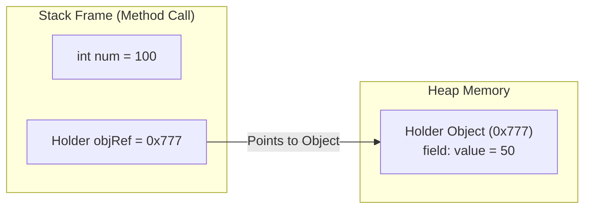

# ☕ Ultimate Java Core Masterclass & Practice Repository

[](https://www.oracle.com/java/)
[](LICENSE)
[](./BEGINNER_JAVA_GUIDE.md)
[](./INTERVIEW_QA.md)

Welcome to the **Ultimate Java Core Roadmap & Practice Repository** (Recommended Repository Name: **`Java-Core-Basics-to-Advanced-Roadmap`** / **`Java-Core-Masterclass-and-Practice`**)!

Designed to take college students, job seekers, and developers from **absolute basics** to **advanced production Java**, complete with **Real-World Analogies**, **Mermaid Architecture Diagrams**, **25+ Placement Q&As**, and **50+ Solved Practice Programs**.

---

## 🏷️ Recommended Repository Rename
> [!TIP]
> To give your GitHub repository a professional, industry-standard name:
> 1. Go to your repository on GitHub: `https://github.com/Arghya876/Basic-Practice-Programs-in-Java`
> 2. Click **Settings** ⚙️ (Top right tab).
> 3. Under **General -> Repository name**, type: `Java-Core-Basics-to-Advanced-Roadmap` (or `Java-Core-Masterclass-and-Practice`).
> 4. Click **Rename**.

---

## 🎒 New to Coding? Start Here!
👉 **[Read the Ultimate Beginner-Friendly Java Handbook](./BEGINNER_JAVA_GUIDE.md)** for easy real-world analogies (Variables as boxes, Loops as running laps, Objects as cars!).

---

## 📜 Table of Contents
- [☕ Ultimate Java Core Masterclass \& Practice Repository](#-ultimate-java-core-masterclass--practice-repository)
  - [🏷️ Recommended Repository Rename](#️-recommended-repository-rename)
  - [🎒 New to Coding? Start Here!](#-new-to-coding-start-here)
  - [📜 Table of Contents](#-table-of-contents)
  - [⏳ 1. History \& Evolution of Java](#-1-history--evolution-of-java)
  - [🏗️ 2. Java Architecture \& Memory Diagrams](#️-2-java-architecture--memory-diagrams)
  - [🗺️ 3. Complete Basics-to-Advanced 7-Phase Roadmap](#️-3-complete-basics-to-advanced-7-phase-roadmap)
    - [🟢 Phase 1: Java Basics (`/01-java-basics`)](#-phase-1-java-basics-01-java-basics)
    - [🟡 Phase 2: Object-Oriented Programming (OOPs) (`/02-object-oriented-programming`)](#-phase-2-object-oriented-programming-oops-02-object-oriented-programming)
    - [🔵 Phase 3: Strings \& Exception Handling (`/03-exception-handling`)](#-phase-3-strings--exception-handling-03-exception-handling)
    - [🟣 Phase 4: Java Collections Framework (`/04-collections-framework`)](#-phase-4-java-collections-framework-04-collections-framework)
    - [🟤 Phase 5: Java I/O \& File Operations (`/05-java-io-and-file-handling`)](#-phase-5-java-io--file-operations-05-java-io-and-file-handling)
    - [🔴 Phase 6: Multithreading \& Concurrency (`/06-multithreading-and-concurrency`)](#-phase-6-multithreading--concurrency-06-multithreading-and-concurrency)
    - [⚡ Phase 7: Modern Java Features (`/07-modern-java-features`)](#-phase-7-modern-java-features-07-modern-java-features)
  - [❓ 4. Core Java Placement \& Interview Q\&A](#-4-core-java-placement--interview-qa)
  - [💻 5. Solved Coding Challenges](#-5-solved-coding-challenges)
  - [🚀 6. How to Run the Programs](#-6-how-to-run-the-programs)

---

## ⏳ 1. History & Evolution of Java

Java was created by **James Gosling** and his team at **Sun Microsystems** in **1991** (initially named *Oak*, renamed to *Java* in 1995). Key goal: **"Write Once, Run Anywhere" (WORA)**.

| Version | Release Year | Milestone Features |
| :--- | :---: | :--- |
| **JDK 1.0** | 1996 | WORA runtime model. |
| **J2SE 1.2** | 1998 | Collection Framework & JIT Compiler. |
| **Java SE 5.0** | 2004 | Generics, Enums, Autoboxing, For-Each loop. |
| **Java SE 8 (LTS)** | 2014 | Lambdas, Stream API, Optional, `java.time`. |
| **Java SE 17 (LTS)**| 2021 | Records, Sealed Classes, Pattern Matching. |
| **Java SE 21 (LTS)**| 2023 | Virtual Threads (Project Loom), Pattern Matching for Switch. |

---

## 🏗️ 2. Java Architecture & Memory Diagrams

### Stack vs Heap Memory Diagram



---

## 🗺️ 3. Complete Basics-to-Advanced 7-Phase Roadmap

### 🟢 Phase 1: Java Basics ([`/01-java-basics`](./01-java-basics))
- **Step 1**: [Syntax & Main Entry Point](./01-java-basics/step-01-introduction-and-syntax)
- **Step 2**: [Variables & Type Casting](./01-java-basics/step-02-variables-and-data-types)
- **Step 3**: [Scanner Console Input](./01-java-basics/step-03-user-input)
- **Step 4**: [Operators & Expressions](./01-java-basics/step-04-operators)
- **Step 5**: [Decision Making (If-Else, Switch)](./01-java-basics/step-05-decision-making-conditionals)
- **Step 6**: [Loops & Iterations](./01-java-basics/step-06-loops-and-iterations)
- **Step 7**: [Arrays & Data Structures (Binary Search, Matrix Operations)](./01-java-basics/step-07-arrays-and-data-structures)
- **Step 8**: [Math & Logical Programs (Fibonacci, Prime, GCD/LCM)](./01-java-basics/step-08-math-and-logical-programs)
- **Step 9**: [Methods & Recursion](./01-java-basics/step-09-methods-and-recursion)

---

### 🟡 Phase 2: Object-Oriented Programming (OOPs) ([`/02-object-oriented-programming`](./02-object-oriented-programming))
- [ClassAndObjectDemo.java](./02-object-oriented-programming/ClassAndObjectDemo.java): Car blueprint & real car objects.
- [EncapsulationDemo.java](./02-object-oriented-programming/EncapsulationDemo.java): Protecting Bank Account balance using `private`, `getters`, `setters`.
- [InheritanceDemo.java](./02-object-oriented-programming/InheritanceDemo.java): Parent `Animal` -> Child `Dog` & `Cat` with `extends`.
- [PolymorphismDemo.java](./02-object-oriented-programming/PolymorphismDemo.java): Overloading vs Overriding (`@Override`).
- [AbstractionDemo.java](./02-object-oriented-programming/AbstractionDemo.java): Abstract `Shape` & `Playable` Interface.
- [InterfaceAndMultipleInheritance.java](./02-object-oriented-programming/InterfaceAndMultipleInheritance.java): Multiple interfaces, `default` methods, and resolving Diamond problem.

---

### 🔵 Phase 3: Strings & Exception Handling ([`/03-exception-handling`](./03-exception-handling))
- [StringBasicsDemo.java](./03-exception-handling/StringBasicsDemo.java): String methods, `.substring()`, `.equals()`.
- [ExceptionHandlingDemo.java](./03-exception-handling/ExceptionHandlingDemo.java): Safe division & array protection using `try-catch-finally`.

---

### 🟣 Phase 4: Java Collections Framework ([`/04-collections-framework`](./04-collections-framework))
- [ArrayListDemo.java](./04-collections-framework/ArrayListDemo.java): Dynamic auto-resizing list (`.add()`, `.get()`, `.remove()`).
- [HashMapDemo.java](./04-collections-framework/HashMapDemo.java): Key-value dictionary lookup (`.put()`, `.get()`).
- [HashSetAndTreeSetDemo.java](./04-collections-framework/HashSetAndTreeSetDemo.java): Unordered $O(1)$ HashSet vs Sorted $O(\log N)$ TreeSet.
- [QueueAndPriorityQueueDemo.java](./04-collections-framework/QueueAndPriorityQueueDemo.java): FIFO Queue, Min-Heap & Max-Heap Priority Queues.

---

### 🟤 Phase 5: Java I/O & File Operations ([`/05-java-io-and-file-handling`](./05-java-io-and-file-handling))
- [FileReadWriteDemo.java](./05-java-io-and-file-handling/FileReadWriteDemo.java): Creating files, writing notes with `FileWriter`, reading with `Scanner`.

---

### 🔴 Phase 6: Multithreading & Concurrency ([`/06-multithreading-and-concurrency`](./06-multithreading-and-concurrency))
- [ThreadBasicsDemo.java](./06-multithreading-and-concurrency/ThreadBasicsDemo.java): Running Music player & File download threads concurrently.
- [SynchronizationAndLocks.java](./06-multithreading-and-concurrency/SynchronizationAndLocks.java): Protecting shared counters against Race Conditions using `synchronized`.

---

### ⚡ Phase 7: Modern Java Features ([`/07-modern-java-features`](./07-modern-java-features))
- [ModernJavaDemo.java](./07-modern-java-features/ModernJavaDemo.java): Records (`record Student(name, marks)`), Lambdas `(x -> x * 10)`, and Stream API.
- [StreamAPIMasterclass.java](./07-modern-java-features/StreamAPIMasterclass.java): Intermediate & Terminal Stream operations (`filter`, `map`, `sorted`, `groupingBy`).

---

## ❓ 4. Core Java Placement & Interview Q&A

Read the complete FAANG & Placement guide in [`INTERVIEW_QA.md`](./INTERVIEW_QA.md).

---

## 💻 5. Solved Coding Challenges

Practice 20 essential coding interview problems in [`CODING_CHALLENGES.md`](./CODING_CHALLENGES.md).

---

## 🚀 6. How to Run the Programs

```bash
# Example: Run StreamAPIMasterclass in Phase 7
cd 07-modern-java-features
javac StreamAPIMasterclass.java
java StreamAPIMasterclass
```

---

⭐ **Happy Coding! Star this repository if you find it helpful.**
