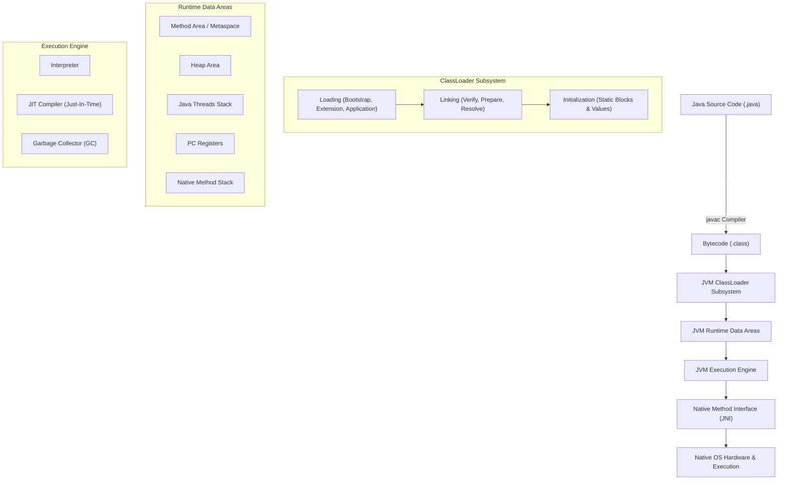
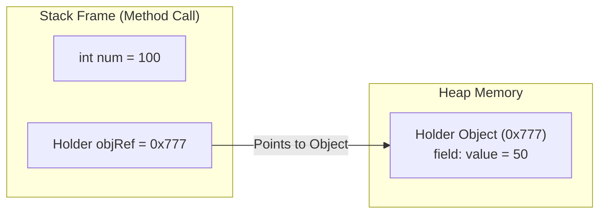
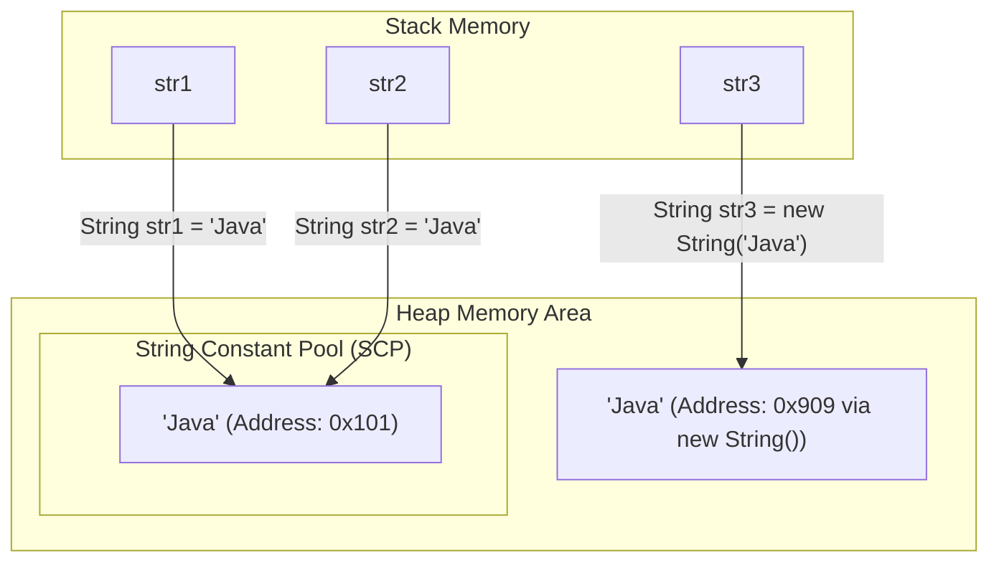
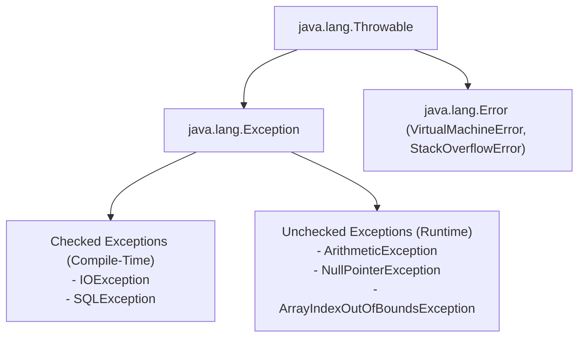

# ☕ Ultimate Java Core Roadmap & Beginner-Friendly Practice Repo

[](https://www.oracle.com/java/)
[](LICENSE)
[](./01-java-basics)
[](https://github.com/Arghya876/Basic-Practice-Programs-in-Java/pulls)

Welcome to the **Ultimate Java Core Roadmap & Practice Repository** (`Java-Core-Roadmap-and-Practice`)! 

Whether you are a **complete beginner**, a **college student**, or an **interview candidate**, this repository is designed step-by-step to guide you from absolute zero to mastering Java Core with interactive **Mermaid Diagrams**, **Beginner-Friendly Guides**, **Interview Q&As**, and **Coding Challenges**.

---

## 🗺️ How to Learn From This Repository (Beginner Roadmap)

Start with **[Phase 1: Java Basics](./01-java-basics)** and follow the numbered steps in order:

```
01-java-basics/
├── 📍 step-01-introduction-and-syntax       ---> Your First Program, Class, Main Method
├── 📍 step-02-variables-and-data-types       ---> Primitives, Memory Sizes & Type Casting
├── 📍 step-03-user-input                     ---> Interactive Console Input using Scanner
├── 📍 step-04-operators                      ---> Arithmetic, Logical, Bitwise & Ternary
├── 📍 step-05-decision-making-conditionals  ---> If-Else, Switch-Case & Logic Trees
├── 📍 step-06-loops-and-iterations           ---> For, While, Do-While & Series
├── 📍 step-07-arrays-and-data-structures     ---> 1D/2D Arrays, Reversing, Min/Max, Sorting
├── 📍 step-08-math-and-logical-programs      ---> Prime, Palindrome, Armstrong, Factorial
└── 📍 step-09-methods-and-recursion          ---> Reusable Functions & Pass-By-Value
```

---

## 📜 Table of Contents
- [☕ Ultimate Java Core Roadmap \& Beginner-Friendly Practice Repo](#-ultimate-java-core-roadmap--beginner-friendly-practice-repo)
  - [🗺️ How to Learn From This Repository (Beginner Roadmap)](#️-how-to-learn-from-this-repository-beginner-roadmap)
  - [📜 Table of Contents](#-table-of-contents)
  - [⏳ 1. History \& Evolution of Java](#-1-history--evolution-of-java)
  - [🏗️ 2. Java Architecture \& Visual Memory Diagrams](#️-2-java-architecture--visual-memory-diagrams)
    - [2.1 JDK vs JRE vs JVM Structure](#21-jdk-vs-jre-vs-jvm-structure)
    - [2.2 JVM Execution Engine Workflow](#22-jvm-execution-engine-workflow)
    - [2.3 Stack vs Heap Memory \& Pass-by-Value Diagram](#23-stack-vs-heap-memory--pass-by-value-diagram)
    - [2.4 String Constant Pool (SCP) Memory Model Diagram](#24-string-constant-pool-scp-memory-model-diagram)
    - [2.5 Exception Handling Hierarchy Diagram](#25-exception-handling-hierarchy-diagram)
  - [🎓 3. Complete Step-by-Step Beginner Modules Index](#-3-complete-step-by-step-beginner-modules-index)
  - [❓ 4. Popular Core Java Interview Questions \& Answers](#-4-popular-core-java-interview-questions--answers)
  - [💻 5. Top Java Coding Challenges](#-5-top-java-coding-challenges)
  - [🚀 6. How to Run the Programs](#-6-how-to-run-the-programs)

---

## ⏳ 1. History & Evolution of Java

Java was created by **James Gosling** and his team (the "Green Team") at **Sun Microsystems** in **1991** (initially named *Oak*, later renamed to *Java* in 1995). The primary objective was: **"Write Once, Run Anywhere" (WORA)**. Sun Microsystems was acquired by **Oracle Corporation** in 2010.

| Version | Release Year | Milestone Features & Highlights |
| :--- | :---: | :--- |
| **JDK 1.0** | 1996 | Initial release of Java language & WORA runtime model. |
| **JDK 1.1** | 1997 | Inner classes, JavaBeans, JDBC, RMI, AWT event model. |
| **J2SE 1.2** | 1998 | Collection Framework introduced, Swing GUI toolkit, JIT Compiler. |
| **J2SE 1.4** | 2002 | `NIO` (Non-blocking I/O), Regular Expressions, Assertions, Logging API. |
| **Java SE 5.0** | 2004 | **Major Update**: Generics, Enums, Annotations, Autoboxing/Unboxing, Varargs, For-Each loop, `java.util.concurrent`. |
| **Java SE 7** | 2011 | Try-with-resources, String in switch, Diamond operator (`<>`), Binary literals. |
| **Java SE 8 (LTS)** | 2014 | **Game Changer**: Lambda Expressions, Stream API, Functional Interfaces, Optional, New Date & Time API (`java.time`), Default & Static Interface methods. |
| **Java SE 9 & 10**| 2017–18 | Java Platform Module System (JPMS / Project Jigsaw), Local variable type inference (`var`). |
| **Java SE 11 (LTS)**| 2018 | New HTTP Client API, Launch single-file source code without explicit compilation, Epsilon GC. |
| **Java SE 17 (LTS)**| 2021 | **Records**, **Sealed Classes & Interfaces**, Pattern Matching for `instanceof`, Text Blocks (`"""`). |
| **Java SE 21 (LTS)**| 2023 | **Virtual Threads (Project Loom)**, Pattern Matching for Switch, Record Patterns, Sequenced Collections. |

---

## 🏗️ 2. Java Architecture & Visual Memory Diagrams

### 2.1 JDK vs JRE vs JVM Structure

```
+-----------------------------------------------------------------------+
|  JDK (Java Development Kit)                                           |
|  [Compiler (javac), Debugger (jdb), Archiver (jar), Dev Tools]       |
|  +-----------------------------------------------------------------+  |
|  |  JRE (Java Runtime Environment)                                 |  |
|  |  [Core Libraries (rt.jar / modules), Integration Libraries]     |  |
|  |  +-----------------------------------------------------------+  |  |
|  |  |  JVM (Java Virtual Machine)                               |  |  |
|  |  |  [ClassLoader | Execution Engine | Garbage Collector]    |  |  |
|  |  +-----------------------------------------------------------+  |  |
|  +-----------------------------------------------------------------+  |
+-----------------------------------------------------------------------+
```

---

### 2.2 JVM Execution Engine Workflow



---

### 2.3 Stack vs Heap Memory & Pass-by-Value Diagram



---

### 2.4 String Constant Pool (SCP) Memory Model Diagram



---

### 2.5 Exception Handling Hierarchy Diagram



---

## 🎓 3. Complete Step-by-Step Beginner Modules Index

### 🟢 Phase 1: Java Basics (`/01-java-basics`)

#### Step 1: Introduction & Syntax ([`step-01-introduction-and-syntax`](./01-java-basics/step-01-introduction-and-syntax))
- [README.md](./01-java-basics/step-01-introduction-and-syntax/README.md): Beginner introduction to class, main method, compilation.
- [HelloWorldAndJVM.java](./01-java-basics/step-01-introduction-and-syntax/HelloWorldAndJVM.java): Hello world & JVM environment props.
- [Literals.java](./01-java-basics/step-01-introduction-and-syntax/Literals.java): Integer, decimal, char, boolean literals.
- [ASCII.java](./01-java-basics/step-01-introduction-and-syntax/ASCII.java): Character to ASCII code mapping.

#### Step 2: Variables & Data Types ([`step-02-variables-and-data-types`](./01-java-basics/step-02-variables-and-data-types))
- [README.md](./01-java-basics/step-02-variables-and-data-types/README.md): Memory sizes & type casting rules.
- [DataTypesAndCasting.java](./01-java-basics/step-02-variables-and-data-types/DataTypesAndCasting.java): Primitives, widening, narrowing casting.
- [Average.java](./01-java-basics/step-02-variables-and-data-types/Average.java): Floating point average calculations.

#### Step 3: Interactive User Input ([`step-03-user-input`](./01-java-basics/step-03-user-input))
- [README.md](./01-java-basics/step-03-user-input/README.md): Scanner guide & newline buffer fix.
- [ScannerAndInput.java](./01-java-basics/step-03-user-input/ScannerAndInput.java): Reading name, age, GPA, strings.

#### Step 4: Operators & Expressions ([`step-04-operators`](./01-java-basics/step-04-operators))
- [README.md](./01-java-basics/step-04-operators/README.md): Operators guide.
- [OperatorsDemo.java](./01-java-basics/step-04-operators/OperatorsDemo.java): Arithmetic, bitwise, shift, ternary operators.

#### Step 5: Decision Making & Conditionals ([`step-05-decision-making-conditionals`](./01-java-basics/step-05-decision-making-conditionals))
- [README.md](./01-java-basics/step-05-decision-making-conditionals/README.md): If-else & switch-case guide.
- [OddEven.java](./01-java-basics/step-05-decision-making-conditionals/OddEven.java): Odd/even check.
- [MaxNum.java](./01-java-basics/step-05-decision-making-conditionals/MaxNum.java): Comparing two numbers.
- [MaxInThree.java](./01-java-basics/step-05-decision-making-conditionals/MaxInThree.java): Finding maximum of 3 numbers.
- [VowelConsonant.java](./01-java-basics/step-05-decision-making-conditionals/VowelConsonant.java): Switch case vowel check.
- [TaxCal.java](./01-java-basics/step-05-decision-making-conditionals/TaxCal.java): Tax calculation rules.

#### Step 6: Loops & Iterations ([`step-06-loops-and-iterations`](./01-java-basics/step-06-loops-and-iterations))
- [README.md](./01-java-basics/step-06-loops-and-iterations/README.md): For, While, Do-While loop guide.
- [NaturalNum.java](./01-java-basics/step-06-loops-and-iterations/NaturalNum.java): N natural numbers.
- [OddNumInRange.java](./01-java-basics/step-06-loops-and-iterations/OddNumInRange.java): Odd numbers filter.
- [MulTable.java](./01-java-basics/step-06-loops-and-iterations/MulTable.java): Multiplication table generator.
- [SumNNum.java](./01-java-basics/step-06-loops-and-iterations/SumNNum.java): Sum of first N numbers.
- [CharPrint.java](./01-java-basics/step-06-loops-and-iterations/CharPrint.java): Alphabet character loop.

#### Step 7: Arrays & Data Structures ([`step-07-arrays-and-data-structures`](./01-java-basics/step-07-arrays-and-data-structures))
- [README.md](./01-java-basics/step-07-arrays-and-data-structures/README.md): 0-indexed memory array guide.
- [ArrayDemo.java](./01-java-basics/step-07-arrays-and-data-structures/ArrayDemo.java), [SumArrayEle.java](./01-java-basics/step-07-arrays-and-data-structures/SumArrayEle.java), [AveArray.java](./01-java-basics/step-07-arrays-and-data-structures/AveArray.java), [BiggestEleArray.java](./01-java-basics/step-07-arrays-and-data-structures/BiggestEleArray.java), [SmallestEleArray.java](./01-java-basics/step-07-arrays-and-data-structures/SmallestEleArray.java), [ArrayRev.java](./01-java-basics/step-07-arrays-and-data-structures/ArrayRev.java), [CopyArrEle.java](./01-java-basics/step-07-arrays-and-data-structures/CopyArrEle.java), [ScearchEleInArr.java](./01-java-basics/step-07-arrays-and-data-structures/ScearchEleInArr.java), [SortArrayInAscending.java](./01-java-basics/step-07-arrays-and-data-structures/SortArrayInAscending.java), [SortArrayInDescending.java](./01-java-basics/step-07-arrays-and-data-structures/SortArrayInDescending.java), [ArrayMethod.java](./01-java-basics/step-07-arrays-and-data-structures/ArrayMethod.java).

#### Step 8: Math & Logical Programs ([`step-08-math-and-logical-programs`](./01-java-basics/step-08-math-and-logical-programs))
- [README.md](./01-java-basics/step-08-math-and-logical-programs/README.md): Math interview problems guide.
- [CountDigits.java](./01-java-basics/step-08-math-and-logical-programs/CountDigits.java), [SumDigit.java](./01-java-basics/step-08-math-and-logical-programs/SumDigit.java), [RevNum.java](./01-java-basics/step-08-math-and-logical-programs/RevNum.java), [Factorial.java](./01-java-basics/step-08-math-and-logical-programs/Factorial.java), [Power.java](./01-java-basics/step-08-math-and-logical-programs/Power.java), [Prime.java](./01-java-basics/step-08-math-and-logical-programs/Prime.java), [PrimeNumBetweenTwo.java](./01-java-basics/step-08-math-and-logical-programs/PrimeNumBetweenTwo.java), [PalindromeNum.java](./01-java-basics/step-08-math-and-logical-programs/PalindromeNum.java), [ArmstrongNum.java](./01-java-basics/step-08-math-and-logical-programs/ArmstrongNum.java), [PerfectNum.java](./01-java-basics/step-08-math-and-logical-programs/PerfectNum.java).

#### Step 9: Methods & Recursion ([`step-09-methods-and-recursion`](./01-java-basics/step-09-methods-and-recursion))
- [README.md](./01-java-basics/step-09-methods-and-recursion/README.md): Functions & pass-by-value guide.
- [MethodBasics.java](./01-java-basics/step-09-methods-and-recursion/MethodBasics.java), [PassByValueDemo.java](./01-java-basics/step-09-methods-and-recursion/PassByValueDemo.java).

---

### 🟡 Future Phases
- 🟡 **[Phase 2: Object-Oriented Programming (OOPs)](./02-object-oriented-programming)**
- 🔵 **[Phase 3: Exception Handling & Strings](./03-exception-handling)**
- 🟣 **[Phase 4: Java Collections Framework](./04-collections-framework)**
- 🟤 **[Phase 5: Java I/O & File Operations](./05-java-io-and-file-handling)**
- 🔴 **[Phase 6: Multithreading & Concurrency](./06-multithreading-and-concurrency)**
- ⚡ **[Phase 7: Modern Java Features](./07-modern-java-features)**

---

## ❓ 4. Popular Core Java Interview Questions & Answers

Read the complete conceptual interview guide in [`INTERVIEW_QA.md`](./INTERVIEW_QA.md):
1. Why is Java platform-independent, but JVM platform-dependent?
2. Breakdown of `public static void main(String[] args)`.
3. Difference between Primitives and Wrapper Classes.
4. Why are Strings Immutable in Java? (String Constant Pool SCP).
5. Difference between `==` operator and `.equals()` method.
6. Proof that Java is strictly Pass-by-Value.
7. Difference between Checked and Unchecked Exceptions.
8. Difference between `final`, `finally`, and `finalize()`.
9. `static` members vs `instance` members.

---

## 💻 5. Top Java Coding Challenges

Practice essential coding interview problems in [`CODING_CHALLENGES.md`](./CODING_CHALLENGES.md):
- **Reverse an Array in-place** -> [`ArrayRev.java`](./01-java-basics/step-07-arrays-and-data-structures/ArrayRev.java)
- **Find Max & Min element in Array** -> [`BiggestEleArray.java`](./01-java-basics/step-07-arrays-and-data-structures/BiggestEleArray.java)
- **Bubble Sort Array** -> [`SortArrayInAscending.java`](./01-java-basics/step-07-arrays-and-data-structures/SortArrayInAscending.java)
- **Optimized Primality Test** -> [`Prime.java`](./01-java-basics/step-08-math-and-logical-programs/Prime.java)
- **Palindrome Number Check** -> [`PalindromeNum.java`](./01-java-basics/step-08-math-and-logical-programs/PalindromeNum.java)
- **Armstrong (Narcissistic) Number Check** -> [`ArmstrongNum.java`](./01-java-basics/step-08-math-and-logical-programs/ArmstrongNum.java)
- **Factorial (Iterative & Recursive)** -> [`Factorial.java`](./01-java-basics/step-08-math-and-logical-programs/Factorial.java)

---

## 🚀 6. How to Run the Programs

### Command Line (CLI)

1. Open terminal and navigate to target step:
   ```bash
   cd "01-java-basics/step-01-introduction-and-syntax"
   ```

2. Compile:
   ```bash
   javac HelloWorldAndJVM.java
   ```

3. Run:
   ```bash
   java HelloWorldAndJVM
   ```

---

⭐ **Happy Coding! Star this repository if you find it helpful.**
