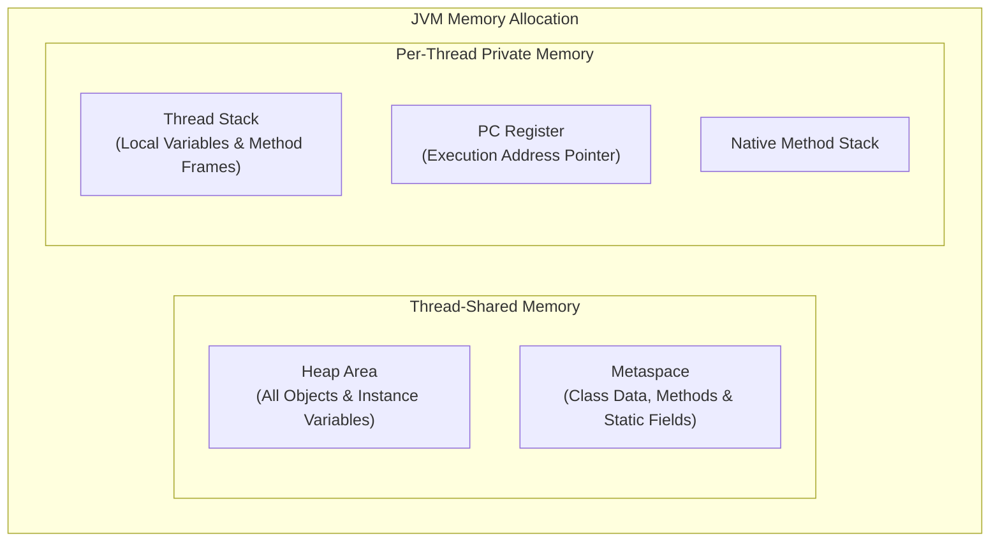
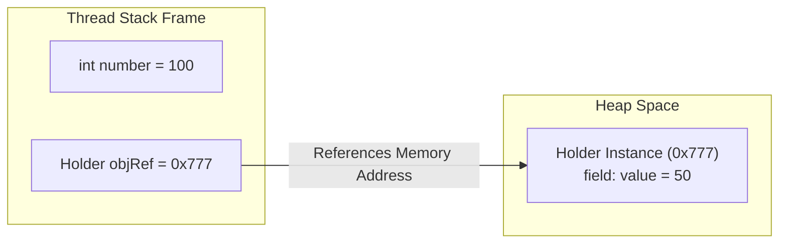

# ☕ Java Learning Concepts: Core Java, OOPs, Collections & Concurrency Masterclass

[](https://www.oracle.com/java/)
[](LICENSE)
[](./BEGINNER_JAVA_GUIDE.md)
[](./INTERVIEW_QA.md)

[](https://github.com/Arghya876)
[](https://www.linkedin.com/in/arghya-bhattacharjee876/)
[](https://arghya.tech)

Welcome to **Java Learning Concepts** (`Java-Learning-Concepts`), a comprehensive, beginner-friendly, production-grade learning repository created and maintained by **[Arghya (Arghya876)](https://github.com/Arghya876)**.

This repository takes you from **absolute Java fundamentals** to **advanced production topics (Java 8–21)** — covering **Object-Oriented Programming (OOPs)**, **Java Collections Framework**, **Multithreading & Concurrency**, **Streams API**, **Virtual Threads**, **25+ Technical Interview Q&As**, and **50+ Solved Practice Programs**.

---

## 📜 Table of Contents
- [☕ Java Learning Concepts: Core Java, OOPs, Collections \& Concurrency Masterclass](#-java-learning-concepts-core-java-oops-collections--concurrency-masterclass)
  - [📜 Table of Contents](#-table-of-contents)
  - [🎒 Beginner Handbook](#-beginner-handbook)
  - [⏳ 1. History \& Evolution of Java](#-1-history--evolution-of-java)
  - [🏗️ 2. Java Architecture \& Memory Model](#️-2-java-architecture--memory-model)
  - [🗺️ 3. Complete 7-Phase Java Roadmap](#️-3-complete-7-phase-java-roadmap)
    - [🟢 Phase 1: Java Basics \& Fundamentals (`/01-java-basics`)](#-phase-1-java-basics--fundamentals-01-java-basics)
    - [🟡 Phase 2: Object-Oriented Programming (OOPs) (`/02-object-oriented-programming`)](#-phase-2-object-oriented-programming-oops-02-object-oriented-programming)
    - [🔵 Phase 3: Strings \& Exception Handling (`/03-exception-handling`)](#-phase-3-strings--exception-handling-03-exception-handling)
    - [🟣 Phase 4: Java Collections Framework (`/04-collections-framework`)](#-phase-4-java-collections-framework-04-collections-framework)
    - [🟤 Phase 5: Java I/O \& File Handling (`/05-java-io-and-file-handling`)](#-phase-5-java-io--file-handling-05-java-io-and-file-handling)
    - [🔴 Phase 6: Multithreading \& Concurrency (`/06-multithreading-and-concurrency`)](#-phase-6-multithreading--concurrency-06-multithreading-and-concurrency)
    - [⚡ Phase 7: Modern Java Features (Java 8–21) (`/07-modern-java-features`)](#-phase-7-modern-java-features-java-821-07-modern-java-features)
  - [❓ 4. Core Java Placement \& Technical Interview Q\&A](#-4-core-java-placement--technical-interview-qa)
  - [💻 5. Solved Coding Challenges](#-5-solved-coding-challenges)
  - [🚀 6. How to Run the Programs](#-6-how-to-run-the-programs)
  - [🌐 Author \& Social Profiles](#-author--social-profiles)

---

## 🎒 Beginner Handbook
New to programming? Start with our jargon-free guide:
👉 **[Read the Ultimate Beginner-Friendly Java Handbook](./BEGINNER_JAVA_GUIDE.md)** for intuitive analogies (Variables as labeled boxes, Loops as running laps, Objects as cars!).

---

## ⏳ 1. History & Evolution of Java

Java was created by **James Gosling** and his team at **Sun Microsystems** in **1991** (initially named *Oak*, renamed to *Java* in 1995). Its founding principle is **"Write Once, Run Anywhere" (WORA)**.

| JDK Version | Release Year | Key Features & Milestones |
| :--- | :---: | :--- |
| **JDK 1.0** | 1996 | WORA runtime model, Applets & AWT. |
| **J2SE 1.2** | 1998 | Collection Framework & JIT Compiler introduced. |
| **Java SE 5.0**| 2004 | Generics, Enums, Autoboxing, Enhanced For-Each Loop. |
| **Java SE 8 (LTS)**| 2014 | Lambda Expressions, Stream API, Optional, New Date & Time API (`java.time`). |
| **Java SE 17 (LTS)**| 2021 | Records, Sealed Classes, Pattern Matching for `instanceof`. |
| **Java SE 21 (LTS)**| 2023 | Virtual Threads (Project Loom), Pattern Matching for Switch, Sequenced Collections. |

---

## 🏗️ 2. Java Architecture & Memory Model

### JVM Memory Regions



### Stack vs Heap Allocation



---

## 🗺️ 3. Complete 7-Phase Java Roadmap

### 🟢 Phase 1: Java Basics & Fundamentals ([`/01-java-basics`](./01-java-basics))

| Category | Program Files | Concept / Topic |
| :--- | :--- | :--- |
| **Syntax & Basics** | [`HelloWorldAndJVM.java`](./01-java-basics/HelloWorldAndJVM.java), [`Literals.java`](./01-java-basics/Literals.java), [`ASCII.java`](./01-java-basics/ASCII.java) | JVM structure, data types, ASCII encoding |
| **Data Types & Casting** | [`DataTypesAndCasting.java`](./01-java-basics/DataTypesAndCasting.java), [`Average.java`](./01-java-basics/Average.java) | Primitives, implicit & explicit casting |
| **User Input & Operators** | [`ScannerAndInput.java`](./01-java-basics/ScannerAndInput.java), [`OperatorsDemo.java`](./01-java-basics/OperatorsDemo.java) | `Scanner`, arithmetic, logical, bitwise & ternary operators |
| **Conditionals** | [`OddEven.java`](./01-java-basics/OddEven.java), [`MaxNum.java`](./01-java-basics/MaxNum.java), [`MaxInThree.java`](./01-java-basics/MaxInThree.java), [`VowelConsonant.java`](./01-java-basics/VowelConsonant.java), [`TaxCal.java`](./01-java-basics/TaxCal.java) | `if-else`, nested conditionals, `switch` statements |
| **Loops & Iteration** | [`NaturalNum.java`](./01-java-basics/NaturalNum.java), [`CharPrint.java`](./01-java-basics/CharPrint.java), [`MulTable.java`](./01-java-basics/MulTable.java), [`SumNNum.java`](./01-java-basics/SumNNum.java), [`OddNumInRange.java`](./01-java-basics/OddNumInRange.java) | `while`, `for`, `do-while` loops |
| **Arrays & Algorithms** | [`ArrayDemo.java`](./01-java-basics/ArrayDemo.java), [`ArrayMethod.java`](./01-java-basics/ArrayMethod.java), [`ArrayRev.java`](./01-java-basics/ArrayRev.java), [`BiggestEleArray.java`](./01-java-basics/BiggestEleArray.java), [`SmallestEleArray.java`](./01-java-basics/SmallestEleArray.java), [`BinarySearchDemo.java`](./01-java-basics/BinarySearchDemo.java), [`SortArrayInAscending.java`](./01-java-basics/SortArrayInAscending.java), [`SortArrayInDescending.java`](./01-java-basics/SortArrayInDescending.java), [`MatrixOperations.java`](./01-java-basics/MatrixOperations.java) | 1D & 2D arrays, Binary Search, Bubble Sort, Matrix operations |
| **Math & Logic** | [`CountDigits.java`](./01-java-basics/CountDigits.java), [`SumDigit.java`](./01-java-basics/SumDigit.java), [`RevNum.java`](./01-java-basics/RevNum.java), [`PalindromeNum.java`](./01-java-basics/PalindromeNum.java), [`Prime.java`](./01-java-basics/Prime.java), [`FibonacciSeries.java`](./01-java-basics/FibonacciSeries.java), [`GCDandLCM.java`](./01-java-basics/GCDandLCM.java), [`ArmstrongNum.java`](./01-java-basics/ArmstrongNum.java), [`PerfectNum.java`](./01-java-basics/PerfectNum.java) | Mathematical algorithms & number theory |
| **Methods & Semantics** | [`MethodBasics.java`](./01-java-basics/MethodBasics.java), [`PassByValueDemo.java`](./01-java-basics/PassByValueDemo.java) | Method overloading, pass-by-value semantics |

---

### 🟡 Phase 2: Object-Oriented Programming (OOPs) ([`/02-object-oriented-programming`](./02-object-oriented-programming))

| Program File | Core Concept |
| :--- | :--- |
| [`ClassAndObjectDemo.java`](./02-object-oriented-programming/ClassAndObjectDemo.java) | Blueprints (`Class`), instances (`Object`), constructors, and methods. |
| [`EncapsulationDemo.java`](./02-object-oriented-programming/EncapsulationDemo.java) | Data hiding with `private` fields, getters, setters, and validation logic. |
| [`InheritanceDemo.java`](./02-object-oriented-programming/InheritanceDemo.java) | Code reuse via `extends`, `super` keyword, and single/multilevel inheritance. |
| [`PolymorphismDemo.java`](./02-object-oriented-programming/PolymorphismDemo.java) | Method Overloading (compile-time) vs Method Overriding (runtime with `@Override`). |
| [`AbstractionDemo.java`](./02-object-oriented-programming/AbstractionDemo.java) | Abstract classes, abstract methods, and contract-driven development. |
| [`InterfaceAndMultipleInheritance.java`](./02-object-oriented-programming/InterfaceAndMultipleInheritance.java) | `interface`, `implements`, `default` methods, and resolving the Diamond Problem. |

---

### 🔵 Phase 3: Strings & Exception Handling ([`/03-exception-handling`](./03-exception-handling))

| Program File | Core Concept |
| :--- | :--- |
| [`StringBasicsDemo.java`](./03-exception-handling/StringBasicsDemo.java) | String immutability, String Constant Pool (SCP), `StringBuilder` vs `StringBuffer`. |
| [`ExceptionHandlingDemo.java`](./03-exception-handling/ExceptionHandlingDemo.java) | Safe execution using `try`, `catch`, `finally`, `throw`, `throws`, and custom exceptions. |

---

### 🟣 Phase 4: Java Collections Framework ([`/04-collections-framework`](./04-collections-framework))

| Program File | Core Concept |
| :--- | :--- |
| [`ArrayListDemo.java`](./04-collections-framework/ArrayListDemo.java) | Dynamic resizable arrays (`ArrayList`), iterations, and utility methods. |
| [`HashMapDemo.java`](./04-collections-framework/HashMapDemo.java) | Key-value store (`HashMap`), bucket hashing, $O(1)$ operations, and iteration patterns. |
| [`HashSetAndTreeSetDemo.java`](./04-collections-framework/HashSetAndTreeSetDemo.java) | Duplicate-free collections: $O(1)$ `HashSet` vs sorted $O(\log N)$ `TreeSet`. |
| [`QueueAndPriorityQueueDemo.java`](./04-collections-framework/QueueAndPriorityQueueDemo.java) | FIFO `Queue`, Min-Heap & Max-Heap priority queues using `PriorityQueue`. |

---

### 🟤 Phase 5: Java I/O & File Handling ([`/05-java-io-and-file-handling`](./05-java-io-and-file-handling))

| Program File | Core Concept |
| :--- | :--- |
| [`FileReadWriteDemo.java`](./05-java-io-and-file-handling/FileReadWriteDemo.java) | File creation, writing (`FileWriter`), reading (`Scanner`/`BufferedReader`), and error safety. |

---

### 🔴 Phase 6: Multithreading & Concurrency ([`/06-multithreading-and-concurrency`](./06-multithreading-and-concurrency))

| Program File | Core Concept |
| :--- | :--- |
| [`ThreadBasicsDemo.java`](./06-multithreading-and-concurrency/ThreadBasicsDemo.java) | Concurrent execution using `Thread` class and `Runnable` interface. |
| [`SynchronizationAndLocks.java`](./06-multithreading-and-concurrency/SynchronizationAndLocks.java) | Preventing race conditions on shared state using `synchronized` blocks and locks. |

---

### ⚡ Phase 7: Modern Java Features (Java 8–21) ([`/07-modern-java-features`](./07-modern-java-features))

| Program File | Core Concept |
| :--- | :--- |
| [`ModernJavaDemo.java`](./07-modern-java-features/ModernJavaDemo.java) | Records (`record`), Lambda Expressions (`->`), Functional Interfaces, and `var`. |
| [`StreamAPIMasterclass.java`](./07-modern-java-features/StreamAPIMasterclass.java) | Declarative data processing using Stream API (`filter`, `map`, `collect`, `reduce`, `groupingBy`). |

---

## ❓ 4. Core Java Placement & Technical Interview Q&A

Preparing for campus recruitments, service, or product-based company interviews (FAANG / Tier-1)?
👉 **[Explore the Complete Technical Interview Q&A Guide](./INTERVIEW_QA.md)** covering:
- JVM Internals, GC Generations & Metaspace
- OOPs Pillars & Design Principles
- String Pool & Immutability Deep-Dive
- HashMap Internals (Treeification in Java 8)
- Volatile vs Synchronized & Concurrency Pitfalls
- Java 21 Virtual Threads (Project Loom)

---

## 💻 5. Solved Coding Challenges

Practice top interview coding problems with full solutions:
👉 **[Browse Top Solved Java Coding Challenges](./CODING_CHALLENGES.md)** featuring 20+ problems across Array Reversal, Binary Search, Matrix Transpose, Euclidean GCD, Prime Range Filtering, and HashMap operations.

---

## 🚀 6. How to Run the Programs

Ensure you have JDK 8+ (or JDK 21 for modern features) installed on your system.

```bash
# 1. Clone the repository
git clone https://github.com/Arghya876/Java-Learning-Concepts.git
cd Java-Learning-Concepts

# 2. Navigate to any phase module (e.g., Phase 7 Modern Java)
cd 07-modern-java-features

# 3. Compile the Java source file
javac StreamAPIMasterclass.java

# 4. Execute the compiled Bytecode
java StreamAPIMasterclass
```

---

## 🌐 Author & Social Profiles

Created and curated with ❤️ by **[Arghya (Arghya876)](https://github.com/Arghya876)**.

| Platform | Profile Link |
| :--- | :--- |
| 🐙 **GitHub** | [github.com/Arghya876](https://github.com/Arghya876) |
| 🌐 **Portfolio** | [arghya.tech](https://arghya.tech) |
| 💼 **LinkedIn** | [linkedin.com/in/arghya-bhattacharjee876](https://www.linkedin.com/in/arghya-bhattacharjee876/) |

⭐ **Star this repository** if it helps you in your Java learning journey!
