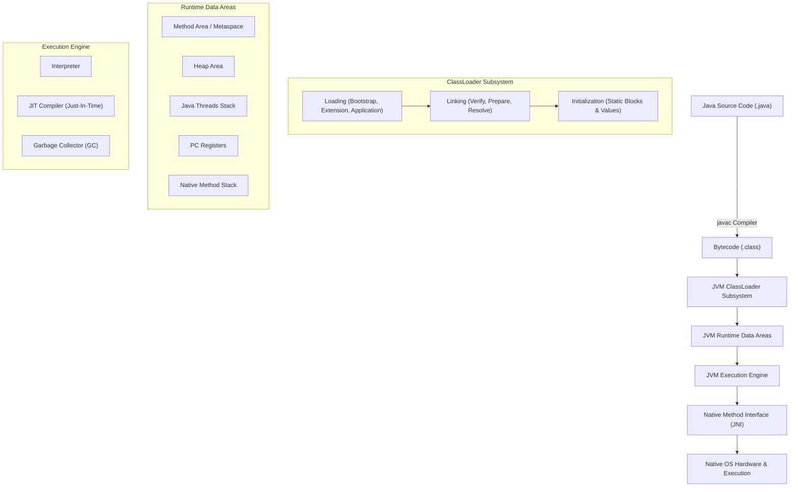
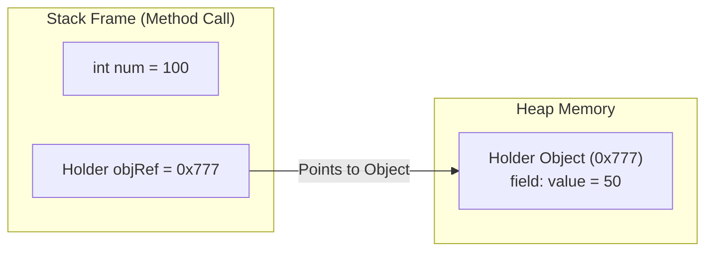
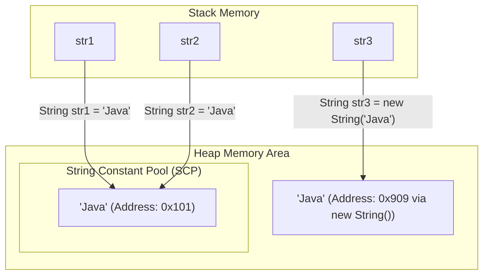
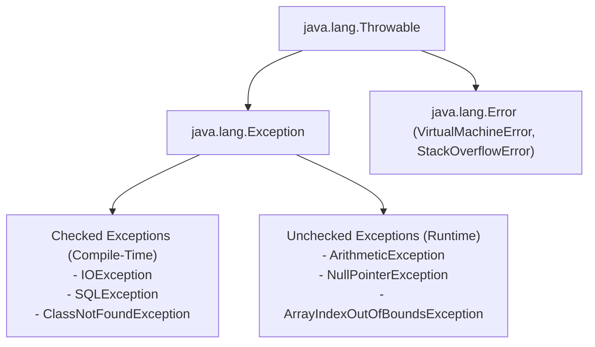

# ☕ Ultimate Java Core Roadmap & Practice Repository

[](https://www.oracle.com/java/)
[](LICENSE)
[](https://github.com/Arghya876/Basic-Practice-Programs-in-Java/pulls)

Welcome to the **Ultimate Java Core Roadmap & Practice Repository** (`Java-Core-Roadmap-and-Practice`)! This repository is designed as a complete, step-by-step master guide for learning Core Java from absolute fundamentals to modern Java (Java 8 through Java 21+ LTS), complete with interactive **Mermaid Diagrams**, **Top Interview Q&As**, and **Coding Challenges**.

---

## 📜 Table of Contents
- [☕ Ultimate Java Core Roadmap \& Practice Repository](#-ultimate-java-core-roadmap--practice-repository)
  - [📜 Table of Contents](#-table-of-contents)
  - [⏳ 1. History \& Evolution of Java](#-1-history--evolution-of-java)
  - [🏗️ 2. Java Architecture \& Visual Memory Diagrams](#️-2-java-architecture--visual-memory-diagrams)
    - [2.1 JDK vs JRE vs JVM Structure](#21-jdk-vs-jre-vs-jvm-structure)
    - [2.2 JVM Execution Engine Workflow](#22-jvm-execution-engine-workflow)
    - [2.3 Stack vs Heap Memory \& Pass-by-Value Diagram](#23-stack-vs-heap-memory--pass-by-value-diagram)
    - [2.4 String Constant Pool (SCP) Memory Model Diagram](#24-string-constant-pool-scp-memory-model-diagram)
    - [2.5 Exception Handling Hierarchy Diagram](#25-exception-handling-hierarchy-diagram)
  - [🗺️ 3. Master Java Core Step-by-Step Roadmap](#️-3-master-java-core-step-by-step-roadmap)
  - [📁 4. Phase 1: Java Basics Practice Index](#-4-phase-1-java-basics-practice-index)
    - [Module 1: Fundamentals \& Syntax](#module-1-fundamentals--syntax)
    - [Module 2: Operators \& Control Flow](#module-2-operators--control-flow)
    - [Module 3: Loops \& Iteration](#module-3-loops--iteration)
    - [Module 4: Arrays \& Operations](#module-4-arrays--operations)
    - [Module 5: Math \& Number Logic Programs](#module-5-math--number-logic-programs)
    - [Module 6: Methods \& Scope](#module-6-methods--scope)
  - [❓ 5. Popular Core Java Interview Questions \& Answers](#-5-popular-core-java-interview-questions--answers)
  - [💻 6. Top Java Coding Challenges](#-6-top-java-coding-challenges)
  - [🚀 7. How to Run the Programs](#-7-how-to-run-the-programs)
    - [Command Line (CLI)](#command-line-cli)
    - [VS Code](#vs-code)

---

## ⏳ 1. History & Evolution of Java

Java was created by **James Gosling** and his team (the "Green Team") at **Sun Microsystems** in **1991** (initially named *Oak*, later renamed to *Java* in 1995). The primary objective was: **"Write Once, Run Anywhere" (WORA)**. Sun Microsystems was acquired by **Oracle Corporation** in 2010.

| Version | Release Year | Milestone Features & Highlights |
| :--- | :---: | :--- |
| **JDK 1.0** | 1996 | Initial release of Java language & WORA runtime model. |
| **JDK 1.1** | 1997 | Inner classes, JavaBeans, JDBC, RMI, AWT event model. |
| **J2SE 1.2** | 1998 | Collection Framework introduced, Swing GUI toolkit, JIT Compiler. |
| **J2SE 1.4** | 2002 | `NIO` (Non-blocking I/O), Regular Expressions, Assertions, Logging API. |
| **Java SE 5.0** | 2004 | **Major Update**: Generics, Enums, Annotations, Autoboxing/Unboxing, Varargs, For-Each loop, `java.util.concurrent`. |
| **Java SE 7** | 2011 | Try-with-resources, String in switch, Diamond operator (`<>`), Binary literals. |
| **Java SE 8 (LTS)** | 2014 | **Game Changer**: Lambda Expressions, Stream API, Functional Interfaces, Optional, New Date & Time API (`java.time`), Default & Static Interface methods. |
| **Java SE 9 & 10**| 2017–18 | Java Platform Module System (JPMS / Project Jigsaw), Local variable type inference (`var`). |
| **Java SE 11 (LTS)**| 2018 | New HTTP Client API, Launch single-file source code without explicit compilation, Epsilon GC. |
| **Java SE 17 (LTS)**| 2021 | **Records**, **Sealed Classes & Interfaces**, Pattern Matching for `instanceof`, Text Blocks (`"""`). |
| **Java SE 21 (LTS)**| 2023 | **Virtual Threads (Project Loom)**, Pattern Matching for Switch, Record Patterns, Sequenced Collections. |

---

## 🏗️ 2. Java Architecture & Visual Memory Diagrams

### 2.1 JDK vs JRE vs JVM Structure

```
+-----------------------------------------------------------------------+
|  JDK (Java Development Kit)                                           |
|  [Compiler (javac), Debugger (jdb), Archiver (jar), Dev Tools]       |
|  +-----------------------------------------------------------------+  |
|  |  JRE (Java Runtime Environment)                                 |  |
|  |  [Core Libraries (rt.jar / modules), Integration Libraries]     |  |
|  |  +-----------------------------------------------------------+  |  |
|  |  |  JVM (Java Virtual Machine)                               |  |  |
|  |  |  [ClassLoader | Execution Engine | Garbage Collector]    |  |  |
|  |  +-----------------------------------------------------------+  |  |
|  +-----------------------------------------------------------------+  |
+-----------------------------------------------------------------------+
```

---

### 2.2 JVM Execution Engine Workflow



---

### 2.3 Stack vs Heap Memory & Pass-by-Value Diagram

In Java, method call frames and primitive variables are stored on the **Stack**, while objects are stored on the **Heap**. References copied into method calls point to the same memory addresses on the Heap.



---

### 2.4 String Constant Pool (SCP) Memory Model Diagram



---

### 2.5 Exception Handling Hierarchy Diagram



---

## 🗺️ 3. Master Java Core Step-by-Step Roadmap

Below is the complete 7-Phase Core Java Learning Path:

```
[Phase 1: Java Basics] 
       │
       ▼
[Phase 2: Object-Oriented Programming (OOPs)] 
       │
       ▼
[Phase 3: Exception Handling & Strings] 
       │
       ▼
[Phase 4: Java Collections Framework (JCF)] 
       │
       ▼
[Phase 5: Java I/O & File Operations] 
       │
       ▼
[Phase 6: Multithreading & Concurrency] 
       │
       ▼
[Phase 7: Modern Java Features (Java 8 - 21+)]
```

### Phase Summary:

1. 🟢 **[Phase 1: Java Basics](./01-basics)** *(Completed & Fully Implemented)*:
   - JDK/JVM Architecture, Syntax, Primitives, Type Casting, Scanner Input.
   - Operators (Arithmetic, Bitwise, Logical, Shift, Ternary).
   - Control Flow (`if-else`, `switch-case`) & Loops (`for`, `while`, `do-while`).
   - Arrays (1D, 2D, Reversing, Sorting, Searching).
   - Math & Number Logic (Prime, Palindrome, Armstrong, Factorial, Fibonacci).
   - Method Signatures, Overloading, Recursion, Pass-by-Value principles.

2. 🟡 **[Phase 2: Object-Oriented Programming (OOPs)](./02-oops)**:
   - Classes, Objects, Constructors, `this` and `super` keywords.
   - Encapsulation, Access Modifiers, Getters/Setters.
   - Inheritance, Polymorphism (Overloading vs Overriding), Dynamic Dispatch.
   - Abstraction (Abstract Classes vs Interfaces, Java 8 default/static methods).

3. 🔵 **[Phase 3: Exception Handling & Strings](./03-exception-handling)**:
   - Checked vs Unchecked Exceptions, `try-catch-finally`, `try-with-resources`.
   - Custom Exceptions, `throw` vs `throws`.
   - String Immutability, String Constant Pool (SCP), `StringBuilder` vs `StringBuffer`.

4. 🟣 **[Phase 4: Java Collections Framework](./04-collections-framework)**:
   - `List` (`ArrayList`, `LinkedList`), `Set` (`HashSet`, `TreeSet`), `Map` (`HashMap`, `TreeMap`).
   - `Iterator`, `Comparable` vs `Comparator`, internal `HashMap` working.

5. 🟤 **[Phase 5: Java I/O & File Operations](./06-java-io-nio)**:
   - Byte & Character Streams, `BufferedReader`/`BufferedWriter`.
   - Serialization & Deserialization (`transient`).
   - Java NIO.2 (`Path`, `Files`).

6. 🔴 **[Phase 6: Multithreading & Concurrency](./05-multithreading)**:
   - `Thread`, `Runnable`, `Callable`, Thread Lifecycle.
   - Synchronization, Race Conditions, `wait()`/`notify()`, `volatile`, Atomic variables.
   - `ExecutorService`, Thread Pools, `Future`.

7. ⚡ **[Phase 7: Modern Java Features](./07-modern-java-features)**:
   - Lambdas, Stream API (`filter`, `map`, `reduce`, `collect`), `Optional`.
   - Records, Sealed Classes, Pattern Matching, Text Blocks.
   - Virtual Threads (Java 21 Project Loom).

---

## 📁 4. Phase 1: Java Basics Practice Index

All Phase 1 foundational programs are organized inside [`/01-basics`](./01-basics):

### Module 1: Fundamentals & Syntax
- [HelloWorldAndJVM.java](file:///d:/Arghya/Codes/VS%20Code/Java/Basic%20Practice%20Programs%20in%20Java/01-basics/01-fundamentals/HelloWorldAndJVM.java): Main entry point, System properties, CLI arguments.
- [DataTypesAndCasting.java](file:///d:/Arghya/Codes/VS%20Code/Java/Basic%20Practice%20Programs%20in%20Java/01-basics/01-fundamentals/DataTypesAndCasting.java): Primitives, memory sizes, implicit (widening) & explicit (narrowing) casting.
- [ScannerAndInput.java](file:///d:/Arghya/Codes/VS%20Code/Java/Basic%20Practice%20Programs%20in%20Java/01-basics/01-fundamentals/ScannerAndInput.java): Interactive user console input & buffer flushing.
- [Literals.java](file:///d:/Arghya/Codes/VS%20Code/Java/Basic%20Practice%20Programs%20in%20Java/01-basics/01-fundamentals/Literals.java): Integer, floating-point, character, and string literals.
- [ASCII.java](file:///d:/Arghya/Codes/VS%20Code/Java/Basic%20Practice%20Programs%20in%20Java/01-basics/01-fundamentals/ASCII.java): Character to ASCII value conversions.
- [Average.java](file:///d:/Arghya/Codes/VS%20Code/Java/Basic%20Practice%20Programs%20in%20Java/01-basics/01-fundamentals/Average.java): Calculating arithmetic mean of numbers.

### Module 2: Operators & Control Flow
- [OperatorsDemo.java](file:///d:/Arghya/Codes/VS%20Code/Java/Basic%20Practice%20Programs%20in%20Java/01-basics/02-operators-and-control-flow/OperatorsDemo.java): Arithmetic, relational, logical short-circuit, bitwise & ternary operators.
- [MaxInThree.java](file:///d:/Arghya/Codes/VS%20Code/Java/Basic%20Practice%20Programs%20in%20Java/01-basics/02-operators-and-control-flow/MaxInThree.java): Decision tree to find maximum among 3 numbers.
- [MaxNum.java](file:///d:/Arghya/Codes/VS%20Code/Java/Basic%20Practice%20Programs%20in%20Java/01-basics/02-operators-and-control-flow/MaxNum.java): Comparing two numbers.
- [OddEven.java](file:///d:/Arghya/Codes/VS%20Code/Java/Basic%20Practice%20Programs%20in%20Java/01-basics/02-operators-and-control-flow/OddEven.java): Odd/Even check using modulus operator.
- [TaxCal.java](file:///d:/Arghya/Codes/VS%20Code/Java/Basic%20Practice%20Programs%20in%20Java/01-basics/02-operators-and-control-flow/TaxCal.java): Income tax calculation using multi-tier conditional blocks.
- [VowelConsonant.java](file:///d:/Arghya/Codes/VS%20Code/Java/Basic%20Practice%20Programs%20in%20Java/01-basics/02-operators-and-control-flow/VowelConsonant.java): Switch-case character classification.

### Module 3: Loops & Iteration
- [CharPrint.java](file:///d:/Arghya/Codes/VS%20Code/Java/Basic%20Practice%20Programs%20in%20Java/01-basics/03-loops-and-iteration/CharPrint.java): Iterating and printing character sequences.
- [MulTable.java](file:///d:/Arghya/Codes/VS%20Code/Java/Basic%20Practice%20Programs%20in%20Java/01-basics/03-loops-and-iteration/MulTable.java): Generating multiplication table using loops.
- [NaturalNum.java](file:///d:/Arghya/Codes/VS%20Code/Java/Basic%20Practice%20Programs%20in%20Java/01-basics/03-loops-and-iteration/NaturalNum.java): Printing sequence of N natural numbers.
- [OddNumInRange.java](file:///d:/Arghya/Codes/VS%20Code/Java/Basic%20Practice%20Programs%20in%20Java/01-basics/03-loops-and-iteration/OddNumInRange.java): Range filtration for odd numbers.
- [SumNNum.java](file:///d:/Arghya/Codes/VS%20Code/Java/Basic%20Practice%20Programs%20in%20Java/01-basics/03-loops-and-iteration/SumNNum.java): Accumulating sum of first N natural numbers.

### Module 4: Arrays & Operations
- [ArrayDemo.java](file:///d:/Arghya/Codes/VS%20Code/Java/Basic%20Practice%20Programs%20in%20Java/01-basics/04-arrays/ArrayDemo.java): Array declaration, instantiation, indexing & traversal.
- [ArrayMethod.java](file:///d:/Arghya/Codes/VS%20Code/Java/Basic%20Practice%20Programs%20in%20Java/01-basics/04-arrays/ArrayMethod.java): Array manipulation techniques.
- [ArrayRev.java](file:///d:/Arghya/Codes/VS%20Code/Java/Basic%20Practice%20Programs%20in%20Java/01-basics/04-arrays/ArrayRev.java): Two-pointer array reversing algorithm.
- [AveArray.java](file:///d:/Arghya/Codes/VS%20Code/Java/Basic%20Practice%20Programs%20in%20Java/01-basics/04-arrays/AveArray.java): Average calculation of array elements.
- [BiggestEleArray.java](file:///d:/Arghya/Codes/VS%20Code/Java/Basic%20Practice%20Programs%20in%20Java/01-basics/04-arrays/BiggestEleArray.java): Finding maximum element in an array.
- [SmallestEleArray.java](file:///d:/Arghya/Codes/VS%20Code/Java/Basic%20Practice%20Programs%20in%20Java/01-basics/04-arrays/SmallestEleArray.java): Finding minimum element in an array.
- [CopyArrEle.java](file:///d:/Arghya/Codes/VS%20Code/Java/Basic%20Practice%20Programs%20in%20Java/01-basics/04-arrays/CopyArrEle.java): Copying elements between array structures.
- [ScearchEleInArr.java](file:///d:/Arghya/Codes/VS%20Code/Java/Basic%20Practice%20Programs%20in%20Java/01-basics/04-arrays/ScearchEleInArr.java): Linear search element lookup.
- [SortArrayInAscending.java](file:///d:/Arghya/Codes/VS%20Code/Java/Basic%20Practice%20Programs%20in%20Java/01-basics/04-arrays/SortArrayInAscending.java): Bubble sort ascending order.
- [SortArrayInDescending.java](file:///d:/Arghya/Codes/VS%20Code/Java/Basic%20Practice%20Programs%20in%20Java/01-basics/04-arrays/SortArrayInDescending.java): Sorting elements in descending order.
- [SumArrayEle.java](file:///d:/Arghya/Codes/VS%20Code/Java/Basic%20Practice%20Programs%20in%20Java/01-basics/04-arrays/SumArrayEle.java): Summing array elements.

### Module 5: Math & Number Logic Programs
- [ArmstrongNum.java](file:///d:/Arghya/Codes/VS%20Code/Java/Basic%20Practice%20Programs%20in%20Java/01-basics/05-math-and-number-programs/ArmstrongNum.java): Narcissistic number check.
- [CountDigits.java](file:///d:/Arghya/Codes/VS%20Code/Java/Basic%20Practice%20Programs%20in%20Java/01-basics/05-math-and-number-programs/CountDigits.java): Counting total digits in a number.
- [Factorial.java](file:///d:/Arghya/Codes/VS%20Code/Java/Basic%20Practice%20Programs%20in%20Java/01-basics/05-math-and-number-programs/Factorial.java): Iterative factorial calculation.
- [PalindromeNum.java](file:///d:/Arghya/Codes/VS%20Code/Java/Basic%20Practice%20Programs%20in%20Java/01-basics/05-math-and-number-programs/PalindromeNum.java): Reversal & comparison logic for palindrome check.
- [PerfectNum.java](file:///d:/Arghya/Codes/VS%20Code/Java/Basic%20Practice%20Programs%20in%20Java/01-basics/05-math-and-number-programs/PerfectNum.java): Sum of proper divisors check.
- [Power.java](file:///d:/Arghya/Codes/VS%20Code/Java/Basic%20Practice%20Programs%20in%20Java/01-basics/05-math-and-number-programs/Power.java): Calculating base raised to exponent.
- [Prime.java](file:///d:/Arghya/Codes/VS%20Code/Java/Basic%20Practice%20Programs%20in%20Java/01-basics/05-math-and-number-programs/Prime.java): Optimized primality test.
- [PrimeNumBetweenTwo.java](file:///d:/Arghya/Codes/VS%20Code/Java/Basic%20Practice%20Programs%20in%20Java/01-basics/05-math-and-number-programs/PrimeNumBetweenTwo.java): Generating prime numbers within an interval.
- [RevNum.java](file:///d:/Arghya/Codes/VS%20Code/Java/Basic%20Practice%20Programs%20in%20Java/01-basics/05-math-and-number-programs/RevNum.java): Digit extraction & number reversal.
- [SumDigit.java](file:///d:/Arghya/Codes/VS%20Code/Java/Basic%20Practice%20Programs%20in%20Java/01-basics/05-math-and-number-programs/SumDigit.java): Summing digits of an integer.

### Module 6: Methods & Scope
- [MethodBasics.java](file:///d:/Arghya/Codes/VS%20Code/Java/Basic%20Practice%20Programs%20in%20Java/01-basics/06-methods-and-scope/MethodBasics.java): Method declaration, parameters, return types, overloading & recursion.
- [PassByValueDemo.java](file:///d:/Arghya/Codes/VS%20Code/Java/Basic%20Practice%20Programs%20in%20Java/01-basics/06-methods-and-scope/PassByValueDemo.java): Java pass-by-value proof for primitives vs object references.

---

## ❓ 5. Popular Core Java Interview Questions & Answers

Read the complete conceptual interview guide in [`INTERVIEW_QA.md`](./INTERVIEW_QA.md):
1. Why is Java platform-independent, but JVM platform-dependent?
2. Breakdown of `public static void main(String[] args)`.
3. Difference between Primitives and Wrapper Classes.
4. Why are Strings Immutable in Java? (String Constant Pool SCP).
5. Difference between `==` operator and `.equals()` method.
6. Proof that Java is strictly Pass-by-Value.
7. Difference between Checked and Unchecked Exceptions.
8. Difference between `final`, `finally`, and `finalize()`.
9. `static` members vs `instance` members.

---

## 💻 6. Top Java Coding Challenges

Practice essential coding interview problems in [`CODING_CHALLENGES.md`](./CODING_CHALLENGES.md):
- **Reverse an Array in-place** (Two-pointer technique) -> [`ArrayRev.java`](./01-basics/04-arrays/ArrayRev.java)
- **Find Max & Min element in Array** -> [`BiggestEleArray.java`](./01-basics/04-arrays/BiggestEleArray.java)
- **Bubble Sort Array** -> [`SortArrayInAscending.java`](./01-basics/04-arrays/SortArrayInAscending.java)
- **Optimized Primality Test** -> [`Prime.java`](./01-basics/05-math-and-number-programs/Prime.java)
- **Palindrome Number Check** -> [`PalindromeNum.java`](./01-basics/05-math-and-number-programs/PalindromeNum.java)
- **Armstrong (Narcissistic) Number Check** -> [`ArmstrongNum.java`](./01-basics/05-math-and-number-programs/ArmstrongNum.java)
- **Factorial (Iterative & Recursive)** -> [`Factorial.java`](./01-basics/05-math-and-number-programs/Factorial.java)

---

## 🚀 7. How to Run the Programs

### Command Line (CLI)

1. Open your terminal or Command Prompt and navigate to the project directory:
   ```bash
   cd "d:/Arghya/Codes/VS Code/Java/Basic Practice Programs in Java"
   ```

2. Compile any target `.java` program using `javac`:
   ```bash
   javac 01-basics/01-fundamentals/HelloWorldAndJVM.java
   ```

3. Run the compiled byte-code using `java`:
   ```bash
   java -cp 01-basics/01-fundamentals HelloWorldAndJVM
   ```

4. Or run directly using Java 11+ single-file execution:
   ```bash
   java 01-basics/01-fundamentals/HelloWorldAndJVM.java
   ```

### VS Code
1. Install the **Extension Pack for Java** in VS Code.
2. Open any `.java` file.
3. Click the **Run** button above `public static void main(String[] args)` or press `Ctrl + F5`.

---

⭐ **Happy Coding! Star this repository if you find it helpful.**
